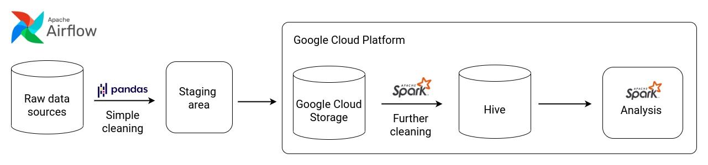
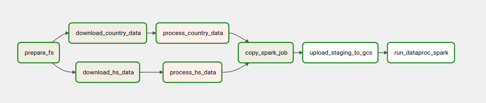
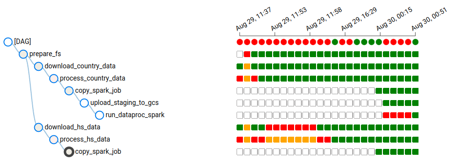

# (WIP) Apache Airflow pipeline and Spark/Hadoop practice

## Pipeline overview



## Data sources
- Fact table: [Japanese trade statistics from 1988 to 2019](https://www.kaggle.com/datasets/zanjibar/100-million-data-csv) (~100M rows)
- Dimension table: [HS Code (2017)](https://github.com/datasets/harmonized-system/)
- Dimension table: [Japanese customs country code](https://www.customs.go.jp/toukei/sankou/code/country_e.htm)

## Technologies used 
- Apache Airflow (`docker-compose` template based on [data-engineering-zoomcamp](https://github.com/DataTalksClub/data-engineering-zoomcamp))
- Apache Spark
- Apache Hadoop 
- Google Cloud Services

## Implemented "physical" pipeline


- **prepare_fs**: create staging directory in staging volume if not exists.
- Transform & load stage 1
  - **download_country_data**: download the _Japanese customs country code_ dataset.
  - **download_hs_data**: download the _HS Code (2017)_ dataset.
  - **process_country_data**: simple transformations (set header row and type casting). Save to staging directory.
  - **process_hs_data**: simple transformation (delete erroneous rows). Save to staging directory.
  - **copy_spark_job**: copy the Spark job responsible for running stage 2 to staging area together with the datasets.
  - **upload_staging_to_gcs**: upload staged files to GCS.
- Transform & load stage 2
  - **run_dataproc_spark**
    - Since the main dataset (_Japanese trade statistics_) is too big (110M rows) to be processed locally, doing so on the Dataproc cluster is a better idea.
    - Load fact table, then:
      - Split `ym` column into separated `year` and `month` columns.
      - Convert `exp_imp` column from number-encoded into text.
      - Extract `hs6_code` from the Japanese 9-digit statistics tracking ID (6-digit HS code + 3-digit domestic code). I could not find the domestic code catalogue so I just got rid of them.
      - Cast several other columns to their correct type.
    - Ingest fact table to Hive, partitioned by `year`. 
    - Ingest dimension tables to Hive.


***Super painful!!!***



## How to

### Setup GCS
1. Create a service account and give it the following permissions (this is a really bad idea, i'm just too lazy to setup proper custom permissions)
   <!-- - BigQuery Admin  -->
   - Storage Admin 
   - Storage Object Admin 
   - Dataproc Admin
   - Viewer 
2. Create the following objects in GCP:
   - A storage bucket.
   - A Dataproc cluster.
3. Download your service account's credential `json` file and place it in `~/.google/credentials/google_credentials.json`.

### Setup local Airflow environment
1. `cd src` 
2. `mkdir -p ./logs ./plugins`
3. `chmod -R 777 dags logs plugins`
4. `mv .env-template .env`
5. Open `.env` file and fill in neccessary information about your GCP project and storage bucket.
6. `docker compose build`
7. `docker compose up`
8. Go to `localhost:8080` (Airflow Web UI), open **Admin > Connection** and add a **Google Cloud** connection with the following information: 
   - Name: `gcp_connection`
   - Credential file: `/.google/credentials/google_credentials.json`
   - Project ID: `<YOUR PROJECT ID>`

### Run the pipeline 
1. Manually load the file `custom_1988_2020.csv` (from the _first_ dataset listed above) to **the root directory of your 
HDFS** (very heavy, downloading it directly to the cluster seems like a better idea).
   ```bash 
   wget <URL> -O custom_1988_2020.csv.zip
   unzip custom_1988_2020.csv.zip
   hadoop dfs -put custom_1988_2020.csv hdfs://
   ```
2. Run the DAG from the local Airflow dashboard.
3. Done. All three datasets should be loaded into Apache Hive running on Dataproc.

### Manual works 
The data has been transformed and stored to Apache Hive for further analytics. Below steps are expected to be done manually.

1. Some analytics with PySpark
2. A simple MapReduce Job


## Future improvements (?)
- Study GCP permission management better to create a service account with sufficient permission.
- Get rid of Linux permission "hacks" like `chmod 777`.
  

## Reference information 
- My Dataproc cluster: 
  - 1 master & 3 workers: `n1-standard-4`, 40 GB disk.
